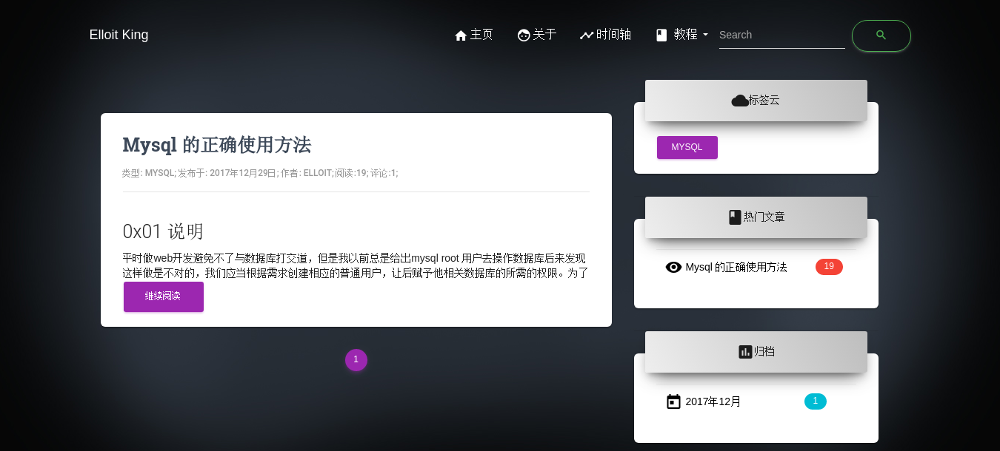
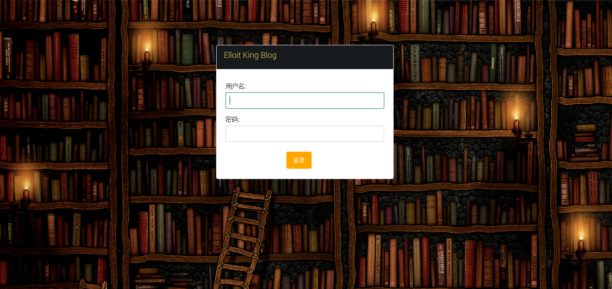

## 说明

这是我个人博客的源码 Django + Mysql + Apache，前端页面运用了Bootstrap编写。
_ _ _

## 要求
1. `sudo git clone git@github.com:imjdl/website.git`
2.  python 环境要求3.0以上
3. `sudo pip3 install -r requirements.txt`  
4.  配置settings.py。在DATABASES里填入你mysql的帐号和密码，在邮件设置里填入相关信息，在GitHub第三方登录填入相应信息
5.  登录mysql创建数据库 `create database blog default character set utf8`，不要使用root账户，具体原因[看这里](http://blog.elloit.xin/2017/12/20/mysql%E6%AD%A3%E7%A1%AE%E4%BD%BF%E7%94%A8%E6%96%B9%E6%B3%95/)

6. `sudo  python3 manage.py makemigrations` 和 ` sudo python3 manage.py migrate`
7. `sudo python3 manage.py collectstatic`
8. `sudo python3 manage.py runserver 80 --insecure`
9. `python3 manage.py createsuperuser` 创建超级用户,访问 http://url/admin 进入后台管理
10. apache 部署Django [参考](http://blog.elloit.xin/2018/04/22/Apache%20%E9%83%A8%E7%BD%B2Django/)
_ _ _

## 最后
#### 首页

#### 登录页面

